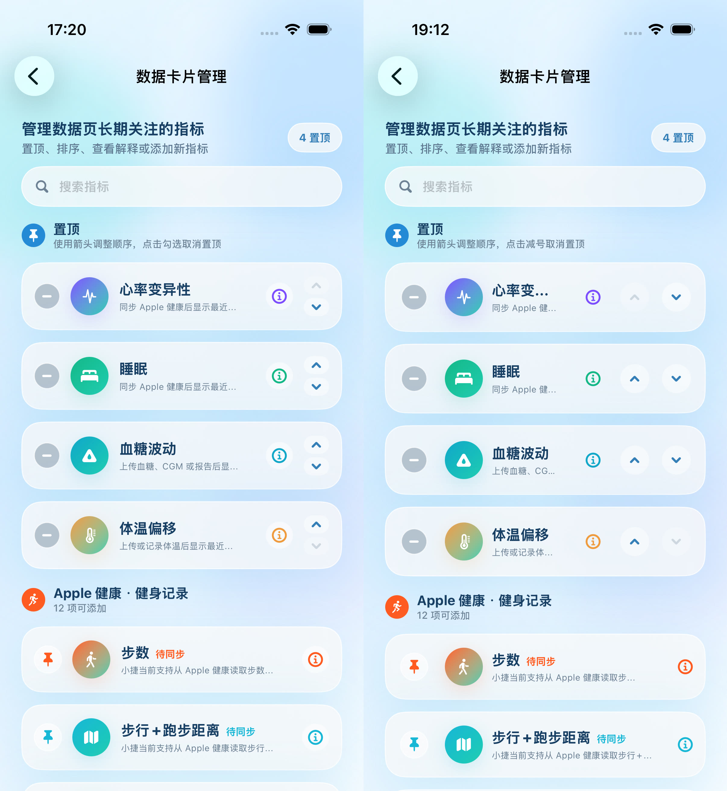
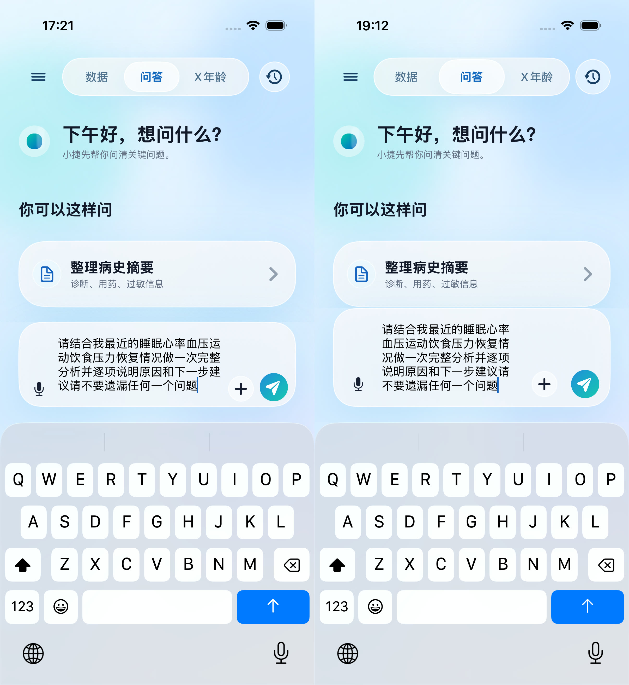

# iOS XAGE 交互习惯与反直觉设计复审

日期：2026-07-12

范围：iOS XAGE；Android 未修改。
目标：沿用现有液态玻璃视觉，系统检查并修复不符合 iOS 常用操作、容易误触、键盘不易退出、导航层级不清和辅助功能命中不一致的问题。

## 结论

本轮未发现阻断发布的 P0。审查发现的 P1 已全部修复并由自动化覆盖；最终源码通过 142 项单元测试、5 项完整 UI 回归、2 项交互专项、iPhone SE 小屏专项和 Release Simulator 构建。

## 用户旅程

1. **数据 / 问答 / X年龄切换 — 健康**
   - 三栏改为原生 page-style 分页，支持点击与双向横滑，首尾不循环。
   - 问答列表的纵向下拉收键盘使用方向门控手势，只识别明显向下拖动，不抢横向分页。
   - 顶部布局取消固定宽度，在小屏上自适应；X年龄补充标准顶部说明入口。

2. **数据卡片管理与排序 — 健康**
   - 管理界面保持独立页面和系统返回，不再呈现“有拖拽横线却不能下拉”的弹窗暗示。
   - “删除”改为准确的“移出首页”；首项上移、末项下移、已置顶再次置顶均显示禁用态。
   - 父级辅助功能标签不再覆盖子按钮；排序、置顶、取消置顶、上下移和解释入口的可访问命中区均至少 44pt。

3. **问答输入与键盘生命周期 — 健康**
   - 输入框按微信式 1–5 行增长，长问题可换行回看和修改。
   - 点击空白、明显向下拖动、发送、打开菜单和切换页面都会释放焦点并关闭键盘。
   - 高强度回归连续发送 12 条问题，输入框未再丢焦点或拼接上一次草稿。

4. **手动记录、登录、家庭和用药表单 — 健康**
   - 数字键盘均提供可见“完成”；手动记录使用稳定的底部配件栏，并支持上一项 / 下一项。
   - 手动记录返回箭头移到左上；返回后先回原指标详情，不再直接关闭全部层级。
   - 登录/注册提供完整焦点顺序；密码显隐往返保留内容与键盘焦点，提交有重复请求保护。
   - 家庭关联和用药编辑有未保存内容时先确认放弃；干净表单可正常下拉，脏表单会隐藏拖拽横线并阻止误关。

5. **危险操作与触控习惯 — 健康**
   - 注销账号保留明确输入和安全取消。
   - 删除用药新增二次确认及全局删除中锁，避免误触、重复请求或另一行静默失败。
   - 评分环“查看详情”和小信息按钮拆成互不重叠的独立按钮。

## 视觉证据

左侧为审查前，右侧为修复后。管理页的导航层级保持一致，同时扩大排序/置顶操作的真实命中区并修正禁用语义。

问答输入保持现有视觉语言，长文本使用有限高度多行编辑，不会把发送按钮和附件按钮挤出输入栏。

关键状态证据：

- [排序禁用态与触控区](after/04-sort-disabled-targets.jpg)
- [手动记录放弃确认与返回层级](after/06-manual-discard.jpg)
- [家庭表单未提交内容确认](after/07-family-discard.jpg)
- [注销安全取消](after/08-delete-safe-cancel.jpg)
- [X年龄顶部说明入口](after/03-xage-top-info.jpg)

## 验证结果

- iPhone 17 Pro / iOS Simulator 26.3.1：最终完整 UI 回归 `5 passed, 0 failed`，耗时 466.960 秒。
- 最新源码交互专项：`2 passed, 0 failed`，覆盖聊天下拉收键盘、横向分页和手动配件栏三按钮 44pt。
- iPhone SE (3rd generation) / iOS Simulator 26.3.1：小屏专项 `1 passed, 0 failed`。
- 单元测试：`142 passed, 0 failed`。
- Release Simulator build：通过。
- `git diff --check`：通过。

## 非阻断观察项

- iOS 26.3.1 Simulator 在手机号键盘首次出现时记录两条 SwiftUI `Invalid frame dimension` runtime warning；对应登录和家庭流程均通过，截图无可见布局异常，未计为失败。真机 TestFlight 验收时继续观察。
- Simulator 不能替代真实 iPhone / Apple Watch 的 HealthKit 授权、后台唤醒和第三方输入法验收。

## 发布

- 版本：`1.0(17)`。
- 真机 Release archive：`Xjie/build/Xjie-TestFlight-1.0-17.xcarchive`，归档成功。
- 归档复核：Bundle ID `com.xjie.app`、生产 HTTPS、HealthKit 与 background-delivery entitlement、用途说明和签名均通过；测试入口、测试凭据、旧 HTTP、私钥/API key 形态及敏感文件扫描均为 0。
- TestFlight：2026-07-12 19:29（Asia/Shanghai）上传返回 `Uploaded Xjie`、`Upload succeeded`、`EXPORT SUCCEEDED`；App Store Connect 已开始 processing。
